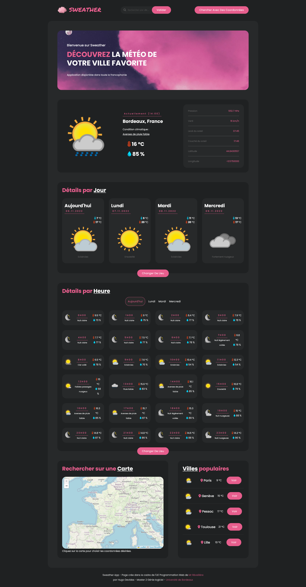

# Sweater

Page web dynamique de prévision météorologique.

## Installation

Aucun pré-requis ou installation n'est nécessaire pour exécuter ce programme, un navigateur quelconque est suffisant.

## Démarrage

Vous pouvez démarrer le projet en exécutant le fichier [main.html] situé à la racine du projet.

## Fabriqué avec

Pour réaliser ce projet j'ai eu besoin d'utiliser:

* l'API de [prévision-meteo](https://www.prevision-meteo.ch/services/)
* la bibliothèque JavaScript [Leaflet](https://leafletjs.com/)

## Auteurs

*  **Hugo Devidas**  _alias_ [@hdevidas](https://github.com/hdevidas)

## License

Ce projet a été réalisée dans le cadre de l'UE Programmation Web du Master 2 - Génie Logiciel, encadré par Mr Réveillère.

## Preview

